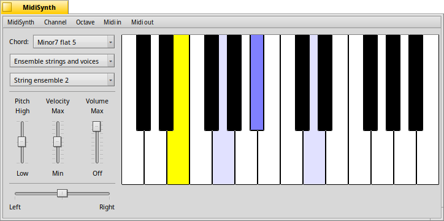
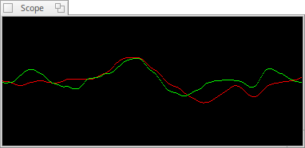

#  MidiSynth

A simple software MIDI keyboard using Haiku's built-in synthesizer or any 
connected MIDI In or Out device.

It can be played with the mouse and/or the computer's keyboard, and also has an 
interface (In and Out) to MIDI hardware and any apps that use MidiKit2.

You can choose the SoundFont to use, or disable the Haiku synthesizer altogether 
when you connect to some other Midi Out device.

There's a simple scope to visualize your sound (the Scope can be resized, but to 
take effect, you currently have to close and re-open the Scope window).

You can select the MIDI channel to be used, and which GM instrument a patch 
should sound. Velocity, Pan, and Pitchbend MIDI parameters are adjusted with
sliders, as well as the synth output volume,

MidiSynth supports chords, which are defined in a file and can be enabled by 
selecting a chord from a the Chords menu. You can even remap the keys on your 
keyboard.    
Chords, KeyMappings and MidiSynth's settings are stored at `~/config/settings/MidiSynth/`.

If you plan to ouput to Haiku's synthesizer instead of controling another MIDI 
device, you need to have a SoundFont installed. You find those at the HaikuDepot.
